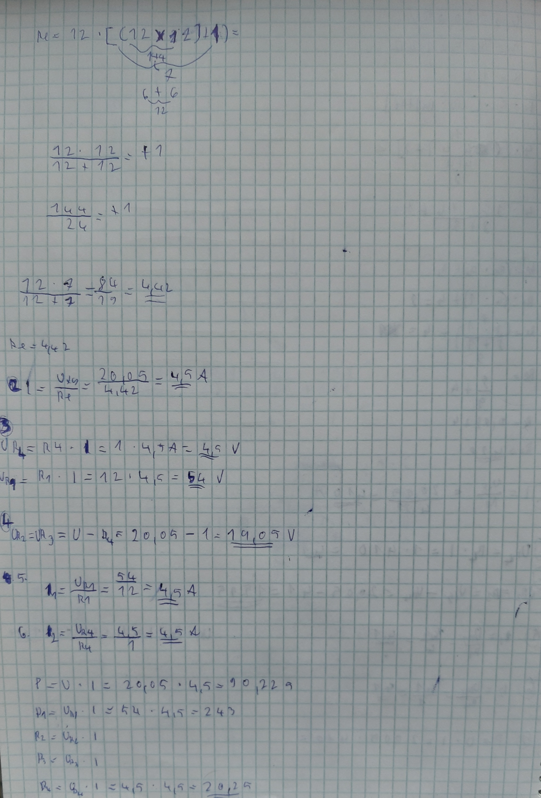
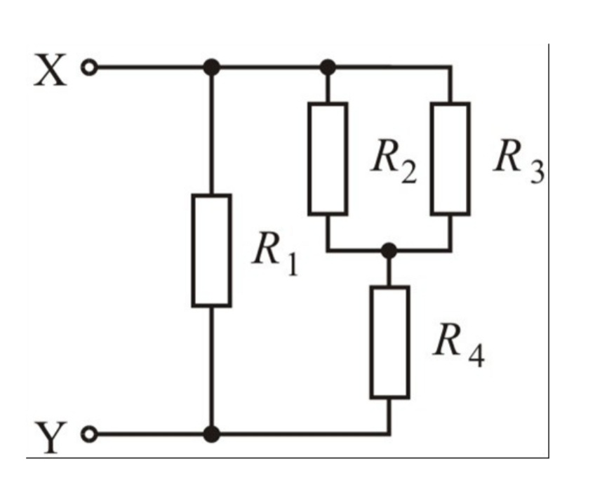

# 1. Számolás

---

## Bevezetés

Ez a projekt egy egyszerű áramkör bemutatását célozza, amely Tinkercadben is megépíthető. Az alábbiakban az áramkör részleteit és paramétereit találod.

---

## Kapcsolási rajz

### Áramkör képei

#### Első kép

#### Második kép

---

## Áramköri paraméterek

Az áramkör főbb paraméterei:
- **U**: 20.05 V
- **R1 = R2 = R3**: 12 Ω
- **Re**: 4.42 Ω

Ezek az értékek biztosítják az áramkör megfelelő működését és stabilitását.

---

## Áramkör funkciója

Az áramkör célja a feszültség és áram irányításának bemutatása egyszerű komponensek segítségével. A következő elemek működnek együtt az áramkörben:
- **Tápegység (U)** biztosítja a szükséges feszültséget.
- **Ellenállások (R1, R2, R3)** limitálják az áramot, hogy elkerüljék a túlmelegedést és biztosítsák a stabil működést.
- **Re** szerepe az áramkör különböző ágai közötti feszültségesés biztosítása.

Ez az áramkör alapvető példaként szolgálhat, amely segítséget nyújt a kezdők számára az áramkörök megértésében és modellezésében.

---

## További forrás

A projekt megépítéséhez látogass el az alábbi linkre:

[Tinkercad projekt](https://www.tinkercad.com/things/bAUMHMKxvVA-doga1-bence/editel?sharecode=Y1ziF5Xxp2YzxPhLN7xaGWX3CvAlFoSvt1xXgubwZRs)

---

