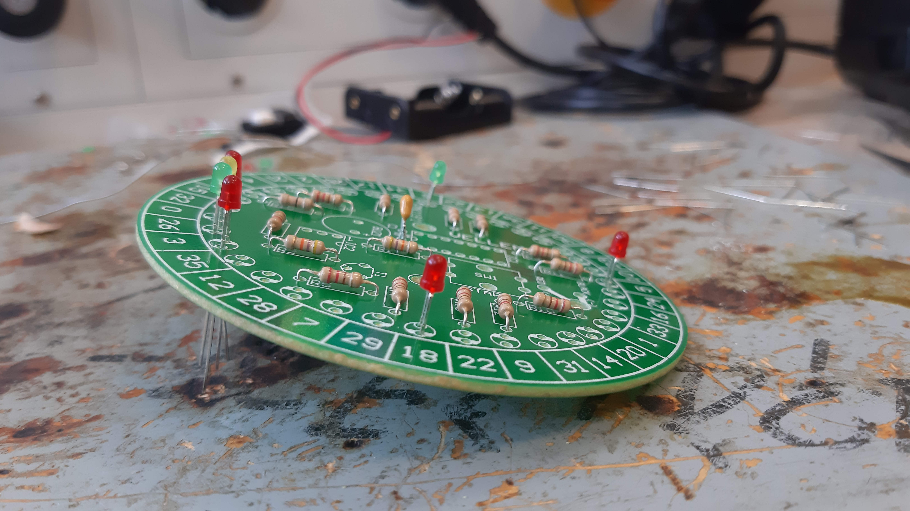
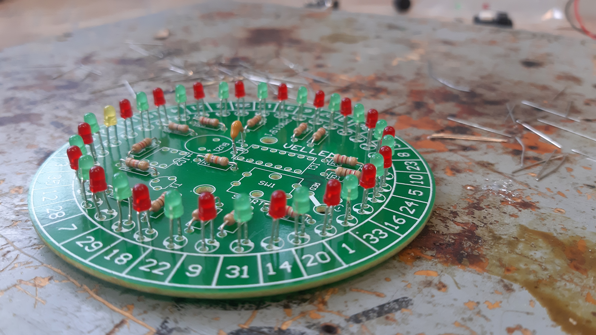
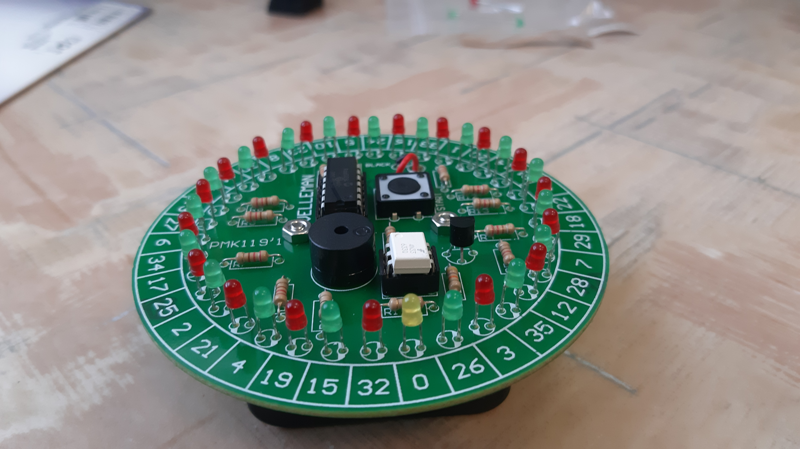

# Velleman Roulette

## Projekt bemutatása

A projekt során elkészítettük a **Velleman Roulette** nevű áramkört. Ez egy szórakoztató eszköz, amely LED-ek segítségével imitál egy szerencsejátékot. Az áramkör elkészítése ideális gyakorlat kezdő és haladó elektronikai tanulók számára, mivel egyszerre tanítja a forrasztási technikákat és az alapvető áramköri elemek működését.

---

## Felhasznált alkatrészek

Az áramkörhöz a következő alkatrészeket használtuk:

- 35 db LED
- 15 db ellenállás
- 1 db hangszóró
- 1 db tranzisztor (BC557)
- 1 db IC
- 1 db IC foglalat (14P és 6P)
- 1 db nyomógomb
- 1 db kondenzátor

---

## Az alkatrészek értékei

Az egyes alkatrészek specifikus értékei a következők:

# Velleman Roulette

## Az alkatrészek értékei

| **Alkatrész**       | **Érték**                  |
|----------------------|----------------------------|
| LED-ek              | 20 mA                     |
| R1-R2               | 47 kΩ                     |
| R3-R14              | 220 kΩ                    |
| R15                 | 0 Ω (jump wire)           |
| Kondenzátor         | 100 µF                    |
| IC foglalat         | Socket1: 14P, Socket2: 6P |
| Tranzisztor         | BC557                     |

---

## Forrasztási lépések

### Első forrasztások

A kezdeti lépésben az ellenállások kerültek a helyükre és lettek beforrasztva:

### LED-ek forrasztása

Fokozatosan lettek beforrasztva a LED-ek:

1. Az első 4 LED:
   

2. További LED-ek hozzáadása:
   

3. Mind a 35 LED beforrasztása:
   
   

---

## Az áramkör elkészülése

Az összes alkatrész beépítése és forrasztása után elkészült az áramkör:

---

## Az áramkör működése

Az áramkör működésének alapelve:
- **LED-ek vezérlése**: A nyomógomb megnyomásával elindul az IC által vezérelt LED-villogás, amely imitálja a rulett forgását. Az IC egy oszcillátort vezérel, amely a LED-eket meghatározott sorrendben villogtatja.
- **Hanghatások**: A hangszóró rövid hangjelzést ad minden lépésnél, így vizuális és akusztikus visszajelzést is biztosít.
- **Tranzisztor szerepe**: A BC557 tranzisztor kapcsolóként működik, amely az IC vezérlésével ki- és bekapcsolja az áramkör bizonyos részeit.
- **Energiatakarékosság**: Az ellenállások értékei optimalizáltak a LED-ek biztonságos működéséhez és az áramfogyasztás minimalizálásához.

---

## Fejlesztési lehetőségek

### 1. **Hangjelzés módosítása**
- Másik frekvenciájú hangszóróval különböző hangokat hozhatunk létre, amelyek különlegesebb visszajelzést nyújtanak.

### 2. **LED-ek fejlesztése**
- Többszínű vagy RGB LED-ek használatával látványosabbá tehető az áramkör.
- Programozható vezérlő IC használatával az egyedi LED-villogási minták bővíthetők.

### 3. **Energiahatékonyság növelése**
- Alacsonyabb fogyasztású LED-ekkel és modern, alacsony áramfelvételű tranzisztorokkal csökkenthető az áramfogyasztás.

---

## Érdekes tények

1. **A LED-ek forradalmasították az elektronikát**:
   - Kezdetben csak kijelzőként használták, mára azonban az energiahatékony világítási megoldások alapjává váltak.
2. **A BC557 tranzisztor népszerűsége**:
   - Ez a kis teljesítményű PNP tranzisztor széles körben elérhető és kiválóan alkalmas oktatási célokra.
3. **Rulett áramkörök alkalmazásai**:
   - Az ilyen típusú projektek gyakran szerepelnek technológiai bemutatókon és szakkörökön, mivel szórakoztatóak és szemléltetik az alapvető elektronikai koncepciókat.

---

