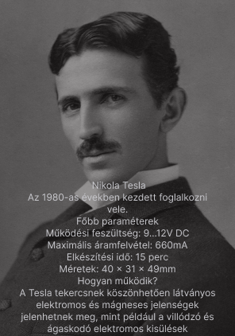
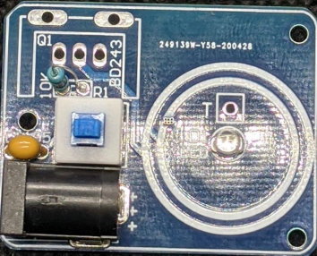
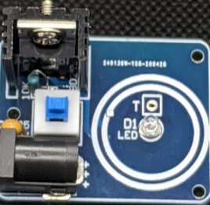

# Tesla Tekercs

Nikola Tesla 1891-ben építette meg a róla elnevezett Tesla-tekercset. A tekercset Tesla röviddel azután hozta létre, hogy Hertz kísérletei napvilágra kerültek. Tesla "elektromos energia továbbítására szolgáló készüléknek" nevezte, és be akarta bizonyítani, hogy az áram vezetékek nélkül is továbbítható.

---

## Történelmi kontextus

Tesla a Hertz által felfedezett elektromágneses hullámok ihletésére kezdett el dolgozni az elektromos energia továbbításának módjain. Hertz kísérletei bebizonyították, hogy az elektromágneses hullámok a térben terjedhetnek, Tesla pedig felismerte, hogy ezzel a technológiával nagy távolságokra is továbbítható lenne az elektromos energia vezetékek nélkül. 

Egyik legnagyobb víziója egy vezeték nélküli energiahálózat kiépítése volt, amely azonban anyagi és technológiai korlátok miatt nem valósulhatott meg teljesen.

---

## A Tesla-tekercs működése
A Tesla-tekercs abban különbözik a transzformátortól, hogy a primer és szekunder áramköre is rezonanciában van az üzemi frekvenciával. Képes megváltoztatni a bevezetett feszültség frekvenciáját, és légmagos kialakítású. A tekercsek tápellátását transzformátor biztosíthatja. Tesla elsőként valósította meg az elektromos rezonancia gyakorlati alkalmazását.

### Felhasználási területek
A Tesla-tekercs segítségével nagymértékű túlfeszültségek és elektromos áramok generálhatók, amelyeket kutatás és fejlesztés során használnak. Ezen kívül népszerű a tudományos bemutatók és a szórakoztatóipar területén, például villámshow-kban.

Az eredeti Tesla-tekercs nagy méretű volt, váltakozó áramú generátorral és nagy teljesítményű transzformátorral működött. Általában 10 000 V és 30 000 V közötti feszültséggel üzemelt.

---

## Biztonsági figyelmeztetések

A Tesla-tekercs működtetése során az alábbi biztonsági szabályokat kell betartani:

- **Magas feszültség**: A Tesla-tekercs jelentős feszültségeket és áramokat generál. Minden tesztelés során gondoskodj megfelelő szigetelésről és távolságról.
- **Tűzveszély**: A nagyfrekvenciás áramok hőtermeléssel járhatnak, amely tűzveszélyt okozhat.
- **Védőfelszerelés**: Használj védőszemüveget, gumikesztyűt és szigetelő cipőt.
- **Egészségügyi kockázatok**: A nagyfrekvenciás elektromágneses mezők károsíthatják az egészséget, különösen pacemakert viselők esetében.

---

## Szükséges alkatrészek

| **Parts**               | **Alkatrészek**          |
|--------------------------|--------------------------|
| PCB (Printed Circuit Board) | Nyomtatott Áramkör    |
| BD243C Transistor        | Tranzisztor             |
| DC Jack                  | Egyenáram Csatlakozó    |
| Heatsink                 | Hűtőborda              |
| 1 Blue LED               | 1 Kék LED              |
| 1 Switch                 | Nyomógomb              |
| 10KΩ Resistor            | 10KΩ Ellenállás         |
| 1UF Capacitor            | 1UF Kondenzátor        |

---

## Kapcsolási rajz

---

## A megvalósítás lépései

### Első lépések
Elkezdtem forrasztani az áramkört:

Több alkatrész került beforrasztásra: nyomógomb, kondenzátor, ellenállás, DC adapter.

### Tranzisztor és hűtőborda
Következő lépésként a tranzisztor és a hűtőborda került beépítésre:

### A kész áramkör
Ezen a ponton a készülék elkészült! Egy DC áramforrást (9-12V) csatlakoztattam a DC jackhez vagy a lap pozitív és negatív sínjéhez. A Tesla-tekercs teszteléséhez egy tesztelő LED-et használtam. Az áram bekapcsolásakor a kék LED világítja meg a tekercs közepét, és amikor a tesztelő LED közel kerül, az is bekapcsol.

---

## Gyakorlati alkalmazások

A Tesla-tekercs ma is fontos szerepet játszik különböző iparágakban:

- **Tudományos kutatás**: Nagyfeszültségű kísérletek és plazmafizikai vizsgálatok.
- **Szórakoztatóipar**: Látványos villámshow-k és Tesla-koncertek.
- **Oktatás**: Elektromos rezonancia és nagyfeszültségű technológia demonstrálása.
- **Egészségügy**: Néhány terápiás eljárásban alacsonyabb feszültséggel működő rezonanciás eszközökön alapul.

---

## Érdekes tények

- Tesla egyik legnagyobb álma az volt, hogy egy egész világot lefedő, vezeték nélküli energiahálózatot hozzon létre, amely mindenki számára elérhetővé teszi az áramot.
- A Tesla-tekercs által generált villámok nem csak látványosak, hanem akár több méteres távolságba is elérhetnek.
- Ma már léteznek mini Tesla-tekercsek, amelyeket hobbi szinten is elkészíthetünk otthon, de ezek teljesítménye jóval kisebb, mint az eredetié.

