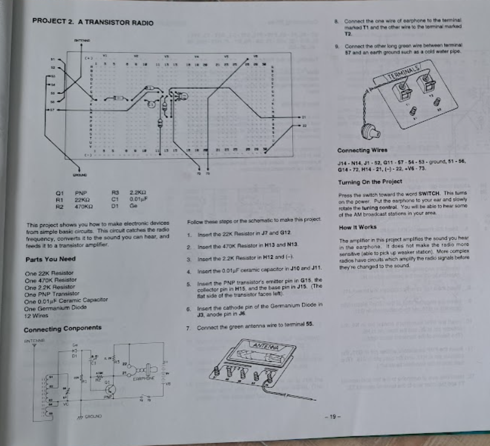
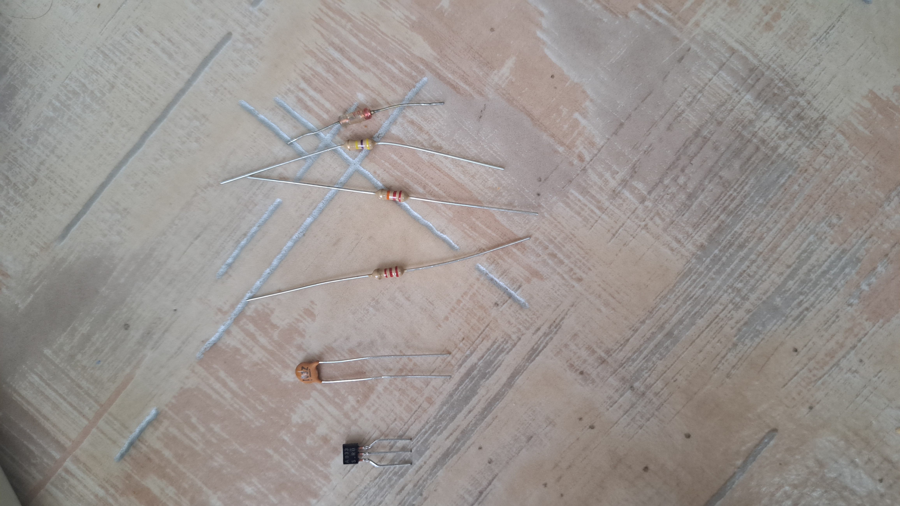
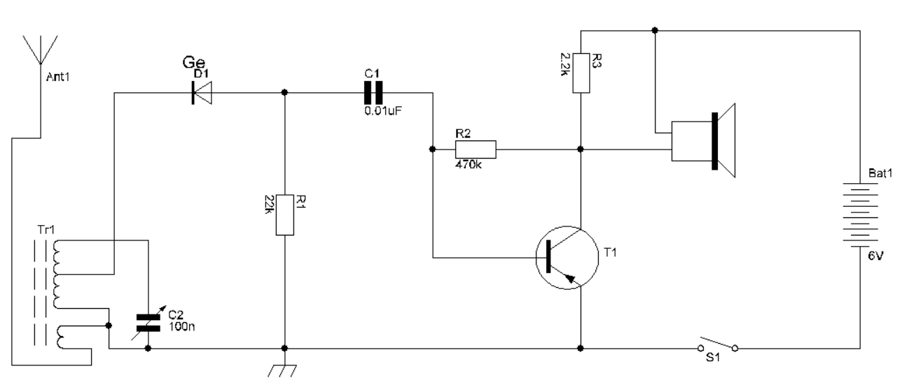

# Transistor Radio

## Projekt bemutatása

Ez a projekt egy AM rádió, amelyet az alábbi könyv alapján készítettünk el:

---

## Felhasznált alkatrészek

Az AM rádióhoz a következő alkatrészeket használtuk fel:

- 3 db Ellenállás
- 1 db Kondenzátor
- 1 db Tranzisztor
- 1 db Dióda

---

## Az alkatrészek értékei

Az egyes alkatrészek értékei a következők:

1. **R1**: 22K ohm  
2. **R2**: 470K ohm  
3. **R3**: 2.2K ohm  
4. **C1**: 0.01 µF  
5. **D1**: Ge (Germanium dióda)  
6. **Q1**: PNP tranzisztor  

---

## Kapcsolási rajz

Az AM rádió kapcsolási rajza az alábbiakban látható:

---

## A rádió működése

Az AM rádió működési elve egyszerű és hatékony:
- **Jel detektálása**: A rádiófrekvenciás (RF) jeleket a Germanium dióda (D1) használatával detektáljuk. A Ge dióda alacsony nyitófeszültsége miatt ideális a rádiófrekvenciás jelek demodulálására, így a hordozófrekvencia eltávolításával a modulált hangjelzés marad meg.
- **Jelerősítés**: A PNP tranzisztor (Q1) felelős a demodulált jel felerősítéséért, hogy azt egy hangszórón vagy fülhallgatón keresztül hallhatóvá tegyük.
- **Hangvisszaadás**: A kondenzátor és az ellenállások segítenek a jelek szűrésében és stabilitásában.

---

## Fejlesztési lehetőségek

További fejlesztésekkel az áramkör még hatékonyabbá tehető:
1. **Érzékenység növelése**:
   - Hozzáadhatunk több tranzisztort a jel erősítéséhez.
   - Nagyobb érzékenységű antennát használhatunk a távolabbi adók vételére.
2. **Jobb hangminőség**:
   - Szűrőáramkörök beépítésével csökkenthető a zaj és a torzítás.
   - Több fokozatú erősítő alkalmazásával a hangjel tisztábbá tehető.
3. **Energiahatékonyság**:
   - Modern, alacsony fogyasztású alkatrészekkel csökkenthető az áramkör energiaigénye.
4. **Digitális átalakítás**:
   - Egy analóg-digitális konverter (ADC) segítségével a jel feldolgozható lenne digitális rendszerekben is.

---

## Gyakorlati alkalmazások

Bár az AM rádió technológia ma már kevésbé használatos, számos területen még mindig értékes:
- **Oktatás**: Alapvető rádiótechnológia megértésére ideális egyszerű áramkörként.
- **Hobbi projektek**: Elektronikai hobbi szinten az AM rádióképítés szórakoztató és oktató jellegű.
- **Demonstrációs célok**: Az RF technológia alapjainak bemutatására is jól alkalmazható.
- **Költséghatékony kommunikáció**: Egyszerű rendszerekben, ahol nincs szükség fejlett digitális technológiára.

---

## Érdekes tények

1. **Történelmi jelentőség**:
   - Az AM rádió a 20. század elején forradalmasította a kommunikációt, lehetővé téve az első tömegesen hallgatott rádióadásokat.
   - Reginald Fessenden 1906-ban az első AM rádióadást is ezzel a technológiával közvetítette.
2. **Tesla és Marconi**:
   - Nikola Tesla és Guglielmo Marconi közötti szabadalmi viták hosszú ideig tartottak, míg végül Teslát ismerték el a rádiótechnológia egyik alapítójaként.
3. **Germanium dióda előnyei**:
   - A Ge diódák alacsony nyitófeszültsége (kb. 0.3 V) ideálissá teszi őket a kisjelű detektálási feladatokhoz, amelyek az AM rádióknál elengedhetetlenek.

---

